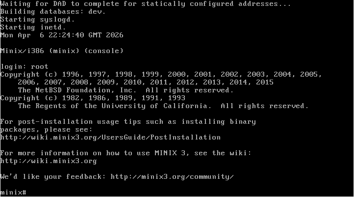
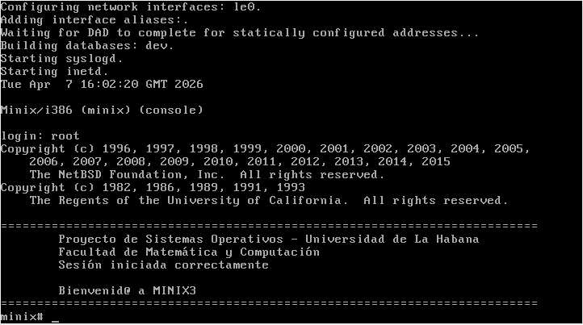
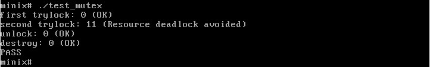

# Informe del proyecto de Sistemas Operativos

---

## Integrante

Ana Laura Oliva Avilés C211

---

## Introducción

El presente proyecto se enmarca en la asignatura sistemas operativos y tiene como objetivo fundamental el aprendizaje práctico y progresivo de los principios esenciales que rigen el funcionamiento de los sistemas operativos modernos. Entre estos principios se abordan la gestión de procesos, la planificación de la CPU, la concurrencia por medio de los hilos de ejecución y el accedo al sistema de archivos. Con este fin, la plataforma de trabajo utilizada es MINIX 3, un sistema operativo de código abierto tipo UNIX basado en un microkernel pequeño que se ejecuta en modo kernel, gran parte de su enfoque se centra en lograr una alta fiabilidad por medio de técnicas de tolerancia a fallos y autorreparación, desde sus inicios ha servido como base pedagógica para la enseñanza de los sistemas operativos tal como se refleja en la literatura básica de Tanenbaum.

Los objetivos generales del proyecto consisten en modificar, extender y analizar componentes reales del sistema operativo, permitiendo la comprensión de la teoría subyacente, así como su materialización en código ejecutable. Para alcanzar dicho propósito, el proyecto se organiza en cuatro actividades concretas. Primeramente, se debe instalar y configurar el entorno de trabajo basado en Oracle VirtualBox y MINIX3, así como personalizar el mensaje de bienvenida del sistema. Seguidamente, se aborda la depuración de un bug en la implementación de pthread_mutex_trylock, lo que requiere analizar la realización entre las capas de compatibilidad y la biblioteca nativa de hilos. En tercer lugar, se implementará un comando de usuario denominado tree, que permite recorrer recursivamente la estructura de directorios empleando llamadas al sistema como opendir, readdir y stat. Finalmente, se modificará el planificador de MINIX para introducir un mecanismo que penalice temporalmente a los procesos con uso intensivo de CPU, distinguiéndolos de aquellos con comportamiento más interactivo o bloqueante.

A través de estas tareas, se espera adquirir una visión integral de la interacción entre los distintos subsistemas de un sistema operativo real, desde as interfaces de programación de aplicaciones hasta las políticas internas de planificación. El presente informe documenta el proceso de trabajo seguido para cada uno de los componente incluyendo el análisis previo, las decisiones de diseño adoptadas, los cambios realizados en el código, las dificultades encontradas y las pruebas de  verificación que confirman el correcto funcionamiento de las soluciones implementadas.

---

## 2.Desarrollo y resultados por componente

---

### 2.1 Instalación y configuración de VirtualBox y MINIX

Para la realización del proyecto se utiliza la máquina vitual Oracle VirtualBox en su versión 7.2.6-4, ejecutándose sobre el sistema anfitrión Arch Linux, esta pc utiliza el kernel 6.19.10-arch1-1 por lo que adicionalmente fue necesario la instalación de virtualbox-host-modules-arch 7.2.6-10, por lo demás se siguieron los pasos establecidos en la wiki de Arch[^1]. Como requisitos de sistema, MINIX recomienda: 1GB de memoria RAM, 8GB de almacenamiento y un procesador i586 o superior[^2], sin embargo, en este proyecto se optó por una configuración superior para garantizar una mayor fluidez: se destinaron 2GB de RAM, 20GB de almacenamiento interno y 2 procesadores. Para la red de la máquina virtual se estableció en modo NAT con el adaptador Pcnet-FAST III (Am79C973).
En esencia se siguió el tutorial del video suministrado por los profesores de la asignatura Sistemas Operativos para la configuración de la máquina virtual y la instalación de MINIX, no hubo contratiempos durante el proceso. Una vez culminado el proceso de instalación de la wiki[^3]. Posteriormente se apagó la maquina virtual, se quitó el disco de instalación y se volvió a abrir la máquina, se ejecutaron los siguientes comandos:

```plaintext
minix# pkgin update
minix# pkgin install git-base
minix# pkgin_sets
```

El primero para actualizar la base de datos local, el segundo para instalar git y el tercero para instalar herramientas necesarias para el desarrollo como openssh (comunicación cifrada a través de red), vim (para poder editar el texto de los diferentes archivos), curl (se utiliza para transmitir datos desde o hacia un servidor), bmake, gmake, binutils, clang (herramientas necesarias para la compilación y el compilador en si), bison (generador de analizadores sintácticos), groff (sistema de formateo de documentos), python 2.7 y perl. Por una cuestión de comodidad también se instaló nano, que es un editor de texto al igual que vim.

Posteriormente vamos a corregir la zona horaria y ajustar el teclado para que sea el español, para eso:

```plaintext
minix# echo export TZ=Cuba > /etc/rc.timezone
minix# cp /usr/lib/keymaps/spanish.map /etc/keymap
```

---

### 2.2 Personalización del mensaje de bienvenida

Vamos a hacer esto en dos partes, en el sistema MINIX de la máquina virtual y en el repositorio como tal:

En el sistema:
Como solo se dispone de una terminal, utilizaremos nano para modificar los archivos ya que lo considero más cómodo que vim. El mensaje de bienvenida que por defecto es el que aparece en el anexo 1, se encuentra en la ruta /etc/motd.

Al ejecutar el comando ls -l /etc/motd podemos ver la siguiente salida:

``` plaintext
-rwxr-xr-x         1 root    wheel 285 Apr 3 02:35 /etc/motd
```

De esto, lo que nos interesa es la primera parte: -rwxr-xr-x, esto quiere decir que es un archivo normal, que el dueño, en este caso el usuario root, puede leer, escribir y ejecutar, además de que el grupo y los otros usuarios solo pueden leer y ejecutar. Como estamos usando el usuario root entonces podemos modificar el archivo.

Introducimos el siguiente comando para modificar el archivo en cuestion:

``` plaintext
minix# nano /etc/motd
```

 Esto nos lleva a la interfaz de nano donde borramos el contenido actual del archivo y lo sustituiremos por el siguiente  mensaje:

``` plaintext
==========================================================
    Proyecto de Sistemas Operativos – Universidad de La Habana
    Facultad de Matemática y Computación
    Sesión iniciada correctamente

    Bienvenid@ a MINIX3
==========================================================
```

Se reinicia la máquina virtual escribiendo reboot en la terminal y una vez que inicie se verá el mensaje anterior, como bien se puede apreciar en el anexo 2.

En github:
Esto obviamente no modifica el repositorio de github, para ello trabajaremos en el pc anfitrión y no en la máquina virtual utilizando vscode. La razón de esto es que vscode facilita el subir cambios a un repositorio ya que usando git desde la terminal de MINIX pide usuario y token. En el repositorio se cambiará el archivo <https://github.com/AnaLauraOliva/minix/tree/master/etc/motd> y se le aplicarán los cambios anteriormente mencionados.

En caso de que se clone el repositorio en /usr/src, al hacer make build los archivo que están en el directorio /etc no se modificarán, por lo que se requiere copiarlo manualmente con:

```plaintext
minix# cp /usr/src/etc/motd /etc
```

Como dato adicional, esto no va a quitar la parte del copyright, en esta ocasión voy a dejarlo. Si se deseara modificarlo vamos, en nuestro proyecto, a la dirección <https://github.com/AnaLauraOliva/minix/tree/master/sys/conf/copyright> y lo modificamos, en el sistema MINIX con el repositorio clonado en /usr/src vamos a /usr/src/sys/conf/copyright, lo modificamos, hacemos una recompilación del sistema y al reiniciar cambiará.

---

### 2.3 Depuración de un bug en pthread

En la carpeta /root se escribió el programa siguiente:

```C

```

``` plaintext
minix# clang -o test_mutex test_mutex.c -lmthread
```

Usamos -lmthread ya que estamos usando hilos dentro de MINIX.

Cuando se ejecuta el tester pasa lo siguiente, el programa se queda totalmente colgado desde la primera llamada a pthread_mutex_trylock. Ver anexo 3.

El método pthread_mutex_trylock está en la dirección /usr/src/minix/lib/libmthread/pthread_compat.c, este archivo es una capa de compatibilidad que convierte o traduce los pthread (estándar de hilos para sistemas tipo UNIX) en mthread, sistema nativo y más ligero de hilos de MINIX. Esto permite que el API estándar de POSIX pueda funcionar con la implementación específica de MINIX. Funciona redirigiendo las llamadas al núcleo mthread. Para utilizar esta capa de compatibilidad directamente se debe comenzar el programa de C con:

``` C
#define _MTHREADIFY_PTHREADS
#include <minix/mthreads.h>
```

Procedemos a ver qué es lo que está fallando, para eso escribimos:

``` plaintext
minix# nano /usr/src/minix/lib/libmthread/pthread_compat.c
```

Aquí vemos el primer problema que explica por que se queda colgado incluso con la primera llamada:

``` C
int pthread_mutex_trylock(pthread_mutex_t *mutex)
{
    if (PTHREAD_MUTEX_INITIALIZER == *mutex) {
        mthread_mutex_init(mutex, NULL);
    }

    return pthread_mutex_trylock(mutex);
}
```

Aquí tenemos una recursión infinita: este método crea el mutex si no existe, pero una vez que lo hace se llama a si mismo infinitamente en lugar de llamar al método mthread_mutex_trylock. Lo corregimos para que quede así:

``` C
int pthread_mutex_trylock(pthread_mutex_t *mutex)
{
    if (PTHREAD_MUTEX_INITIALIZER == *mutex) {
        mthread_mutex_init(mutex, NULL);
    }

    return mthread_mutex_trylock(mutex);
}
```

Para visulizar el cambio en formato diff ver anexo 4.

Hacemos rebuild del sistema y analizamos qué se ha resuelto con esta modificación, para ello volvemos a ejecutar el tester y podemos ver que la primera llamada a pthread_mutex_trylock devuelve 0, la segunda devuelve 11 que es el código que tiene /usr/include/sys/errno.h para EDEADLK, además las llamadas a pthread_mutex_unlock y pthread_mutex_destoy devuelven 0 cada una (ver anexo 5). Esta era la salida esperada tras la corrección, por lo que el bug queda solucionado.

En github este archivo se encuentra en <https://github.com/AnaLauraOliva/minix/tree/master/minix/lib/libmthread/pthread_compat.c>.

### 2.4 Implementación del comando tree

Para la implementación del comando tree de MINIX se utilizó recursión explícita ya que el código refleja directamente el problema: el comando tree pude desglosarse en dos casos: si es un archivo o un enlace simbólico lo imprime y sale, si, por el contrario, es un subdirectorio entra en él y hace lo mismo, lo cual es la definición exacta de una función recursiva. Además, la recursividad explícita aprovecha el call stack(la pila de llamadas del sistema).

Se utilizaron las siguientes llamadas al sistema:

* lstat: Llamada al sistema que se usa para determinar información sobre un archivo en función de su nombre. Recibe dos argumentos: un **const char \*path** que es la ruta del archivo que se  está consultando y un **struct stat \*buf** que es la estructura donde se almacenan los datos del archivo. La función retorna un valor negativo en caso de que ocurra algún fallo. Se utilizó esta función ya que cuando el nombre del archivo hace referencia a un enlace se devuelve la información sobre el enlace.
* opendir: Función del sistema que abre un directorio y crea un flujo para leer su contenido. Recibe un argumento **const char \*dirname** que es la ruta del directorio a abrir. Retorna un puntero DIR\* o NULL en caso de error.
* readdir: Función del sistema que lee la siguiente entrada del flujo abierto. Cada llamada avanza a la siguiente entrada (archivo o subdirectorio). Recibe un argumento **DIR \*dirp** el puntero que devolvió opendir. Retorna un puntero a estructura struct dirent \* con datos de la entrada, o NULL al llegar al final o si hay error
* closedir: Función del sistema que cierra el flujo del directorio y libera los recursos asociados. Recibe un argumento **DIR \*dirp** que es puntero al flujo que se desea cerrar. Retorna 0 si se cierra correctamente y -1 en caso de error.

Antes de imprimirse los nombres, la función print imprime 4*depth espacios, donde depth es un entero que recibe de la función recursiva. Esto da un aspecto más limpio a la lista de directorios.

**¿Cómo se previenen los ciclos?**
Este punto se responde con la función lstat y la macro S_ISLNK:
La función lstat tiene casi el mismo funcionamiento que la función stat, la única diferencia radica en cuando el nombre del archivo hace referencia a un enlace. En este caso, lstat devuelve información sobre el enlace, mientras que stat devuelve información sobre el archivo en sí. Una vez que el **struct stat st** tiene la información del archivo que hace referencia al enlace y ya se imprimió su numbre, para evitar abrir el archivo con opendir, la función walk usa **S_ISLNK** y le pasa st.st_mode para saber si es una referencia, en caso positivo retorna 0 (sale de esa llamada recursiva). De esta forma no se abren las referencias y se evita entrar en un ciclo.

La parte más importante del código es la función walk:

``` C
//counter_t es un struct en el tree.c que es el que permite llevar el conteo de directorios,
//archivos y enlaces del directorio
static int walk(const char *path, const char *name, int depth, counter_t *counter)
{
    struct stat st;
    DIR *dp;
    struct dirent *de;
    if (lstat(path, &st))
    {
        fprintf(stderr, "Error on path %s. No: %s", path, errno);
        return 1;
    }
    if (print(path, name, depth) != 0)
        return 1;
    //estas primeras líneas lo que hacen es rellenar st e imprimir el nombre del archivo o directorio actual
    //print es la función encargada de imprimir el nombre y la indentación
    if (S_ISDIR(st.st_mode))
        counter->dirs++;
    else if (S_ISLNK(st.st_mode))
        counter->links++;
    else
        counter->files++;
    //Esto es para aumentar la variable del counter que corresponda, se usa un puntero para que el valor original también se modifique
    if (!S_ISDIR(st.st_mode) || S_ISLNK(st.st_mode))
    {
        return 0;
    }
    //Esto es lo que evita que se entre en un bucle o que se intente abrir un archivo

    //Las lineas siguientes contienen el proceso recursivo: se abre el directorio y se guarda en dp y luego se llama a walk en cada uno de los elementos que encuentre readdir en dp
    dp = opendir(path);
    if (dp == NULL)
    {
        fprintf(stderr, "Error: Cannot open this directory. Path: %s", path);
        return 1;
    }
    int error = 0;

    while ((de = readdir(dp)) != NULL)
    {
        if (strcmp(de->d_name, ".") == 0 || strcmp(de->d_name, "..") == 0)
            continue;
        char new_path[PATH_MAX]; //esta variable contiene el nuevo directorio
        int n;
        n = snprintf(new_path, sizeof(new_path), "%s/%s", path, de->d_name); // Copiar el nuevo path en la variable
        if (n < 0 || (size_t)n >= sizeof(new_path))
        {
            fprintf(stderr, "%s/%s: path too long\n", path, de->d_name);
            error = 1;
            continue;
        }
        if (walk(new_path, de->d_name, depth + 1, counter) != 0)//Llamado recursivo
            error = 1;
    }
    if (closedir(dp) != 0)//Se cierra el directorio
    {
        fprintf(stderr, "Error: Cannot close this directory. Path:%s", path);
        error = 1;
    }
    return error;
}
```

Esta función recibe sus argumento iniciales de la función main donde path y el name son el argumento que se le pasó al comando, counter es una referencia a la instancia del struct y depth es 0.

En los anexos del 6 al 10 puede apreciarse la comparación entre la salida del tree recién implementado en MINIX3 y en Arch linux con los siguientes casos: directorio actual, ruta absoluta, ruta relativa, manejo de permisos y de directorios inexistentes.

El comando tree recién implementado y el de Linux solo se diferencian en aspectos estéticos(colores y la indentación) y en que nuestro comando muestra archivos y directorios ocultos sin necesidad del flag -a como se puede apreciar en las imagenes antes mencionadas.

## Anexos



**Anexo 1:** Mensaje de bienvenida de minix (sin modificar)



**Anexo 2:** Mensaje de bienvenida de MINIX (modificado)


**Anexo 3:** Salida del programa de prueba antes de la corrección

```diff
 int pthread_mutex_trylock(pthread_mutex_t *mutex)
 {
        if (PTHREAD_MUTEX_INITIALIZER == *mutex) {
                mthread_mutex_init(mutex, NULL);
        }
-       return pthread_mutex_trylock(mutex);
+       return mthread_mutex_trylock(mutex);
 }
```

**Anexo 4:** Corrección del bug de pthread en formato diff.


**Anexo 5:** Salida del programa de prueba tras la corrección


**Anexo 6:** Salida de tree en MINIX3/Arch linux con directorio actual


**Anexo 7:** Salida de tree en MINIX3/Arch linux con ruta absoluta


**Anexo 8:** Salida de tree en MINIX3/Arch linux con ruta relativa


**Anexo 9:** Salida de tree en MINIX3/Arch linux con una carpeta sin permiso de lectura y otra sin permiso de ejecución


**Anexo 10:** Salida de tree en MINIX3/Arch linux cuando el directorio solicitado no existe

## Referencias

[^1]: [https://wiki.archlinux.org/title/VirtualBox_(Español)]

[^2]: [https://wiki.minix3.org/doku.php?id=usersguide:hardwarerequirements]

[^3]: [https://wiki.minix3.org/doku.php?id=usersguide:doinginstallation#runningsetup]
